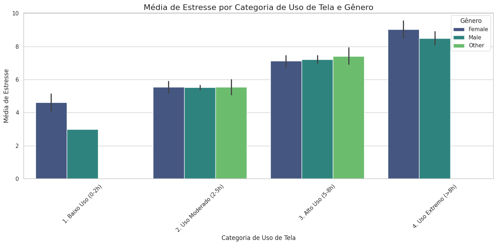
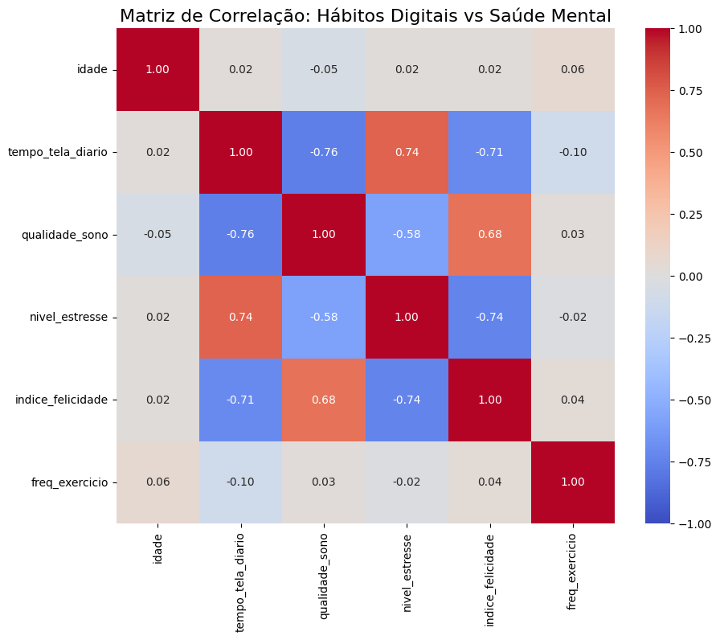
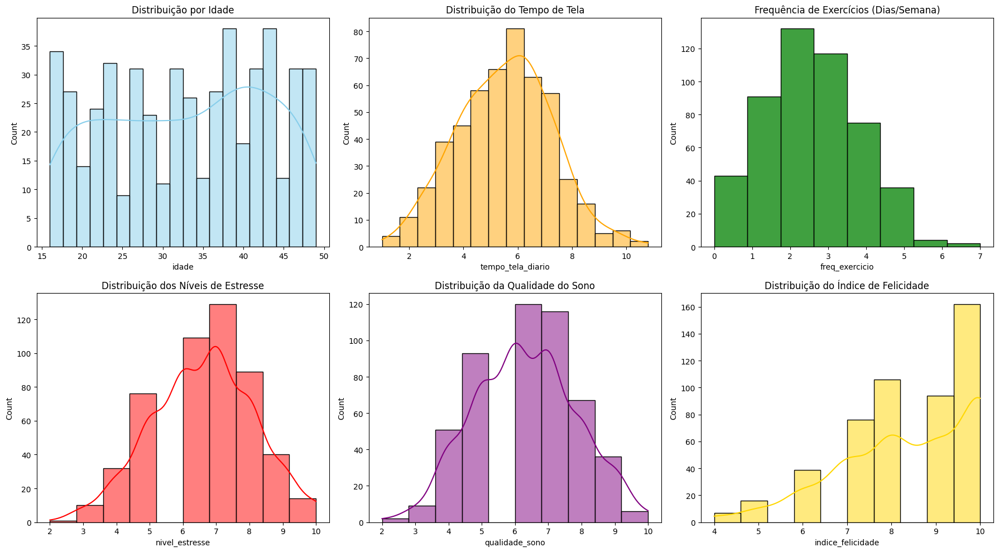

# MVP de Análise de Dados: Impacto das Redes Sociais na Saúde Mental e Bem-Estar

## Identificação

**Aluno:** Eric Koji Nakirimoto 

**Matricula:** 4052025000088

**Disciplina:** Sprint: Engenharia de Dados 2025_02  

## 1. Objetivo do Trabalho

### Problema a ser resolvido
O uso excessivo de redes sociais e o tempo de tela têm sido associados a diversos problemas de saúde mental na sociedade moderna. Este projeto visa quantificar e analisar se existem correlações estatísticas claras entre hábitos digitais (tempo de tela) e indicadores de bem-estar (sono, felicidade, estresse e exercícios) em uma amostra populacional.

### Perguntas para orientar a análise
Para guiar a análise, foram definidas as seguintes perguntas norteadoras:
1.  **Redes Sociais x Estresse:** Existe uma correlação positiva entre o tempo gasto em redes sociais e o nível de estresse reportado?
2.  **Redes Sociais x Felicidade:** O uso intensivo de redes sociais afeta negativamente o índice de felicidade?
3.  **Redes Sociais x Sono:** O tempo de tela impacta a qualidade ou duração do sono?
4.  **Sono, Felicidade e Exercícios:** Existe uma correlação entre qualidade do sono, frequência de exercícios e o índice de felicidade geral?
OBS: Minha esposa vive me incomodando por ficar usando celular antes de dormir. Quero ver se ela está realmente certa. 

---

## 2. Busca e Coleta de Dados

### Fonte de Dados
* **Nome:** Social Media and Mental Health Balance
* **Origem:** Kaggle
* **URL:** [Link para o Dataset](https://www.kaggle.com/datasets/ayeshaimran123/social-media-and-mental-health-balance/data)
* **Formato:** Arquivo plano (CSV).
* **Licença:** Open Data Commons Public Domain Dedication and License (PDDL) v1.0

### Processo de Coleta (Databricks)
1.  **Download:** O arquivo CSV foi baixado da fonte original.
2.  **Upload:** O arquivo foi carregado para o DBFS (Databricks File System) utilizando a interface de upload do Databricks Community Edition.
3.  **Caminho no DBFS:** `workspace.default.mental_health_and_social_media_balance_dataset` 

---

## 3. Modelagem de Dados

Para este MVP, utilizaremos uma arquitetura de **Data Lake** seguindo o padrão **Medallion Architecture** (Bronze, Silver, Gold), que é nativo e otimizado para o Databricks.

### Esquema Proposto (Camadas)

1.  **Camada Bronze (Raw):** Dados brutos ingeridos diretamente do CSV, sem tratamento, salvos em formato Delta.
2.  **Camada Silver (Cleaned/Conformed):**
    * Tratamento de nulos.
    * Renomeação de colunas (tradução para PT-BR ou padronização `snake_case`).
3.  **Camada Gold (Aggregated/Business Level):** Tabela analítica final pronta para responder às perguntas de negócio com dados que serão plotados em um "BI" simulado.

### Catálogo de Dados (Dicionário)

| Nome Original | Nome Tratado (Na camada Silver) | Tipo de Dado | Descrição/Domínio | Valores Esperados |
| :--- | :--- | :--- | :--- | :--- |
| `User_ID` | `id_usuario` | String | Identificador único do participante da pesquisa. | Alfanumérico (ex: IDs anonimizados). |
| `Age` | `idade` | Integer | Idade do participante em anos. | Numérico inteiro (ex: 18 a 60+). |
| `Gender` | `genero` | String | Gênero com o qual o participante se identifica. | Categorias: 'Male', 'Female', 'Non-binary', etc. |
| `Daily_Screen_Time` | `tempo_tela_diario` | Decimal | Tempo médio diário gasto em frente a telas (em horas). | 0.0 a 24.0 horas. |
| `Sleep_Quality` | `qualidade_sono` | Decimal | Avaliação subjetiva da qualidade do sono em uma escala. | 1.0 a 10.0 (onde 10 é excelente). |
| `Stress_Level` | `nivel_estresse` | Decimal | Nível de estresse percebido pelo participante em uma escala. | 1.0 a 10.0 (onde 10 é estresse extremo). |
| `Days_Without_Social_Media` | `dias_sem_redes` | Decimal | Número de dias que a pessoa consegue ou ficou sem usar redes sociais (detox digital). | 0 a valores positivos (dias). |
| `Exercise_Frequency` | `freq_exercicio` | Decimal | Frequência de exercícios físicos realizados por semana. | 0 a 7 (dias por semana) ou valor normalizado. |
| `Social_Media_Platform` | `plataforma_rede_social` | String | Principal plataforma de rede social utilizada pelo participante. | Categorias: 'Instagram', 'TikTok', 'Facebook', 'Twitter/X', etc. |
| `Happiness_Index` | `indice_felicidade` | Decimal | Índice subjetivo de felicidade e bem-estar geral em uma escala. | 1.0 a 10.0 (onde 10 é muito feliz). |

### Linhagem dos Dados
* **Origem:** Kaggle -> CSV.
* **Processo:** `CSV` -> `DataFrame Spark (Leitura)` -> `Tabela Delta Bronze` -> `Limpeza/Tratamento` -> `Tabela Delta Silver` -> `Análise/Correlação` -> `Tabela Delta Gold`.

---

## 4. Carga e Transformação (ETL)

O processo de ETL será realizado utilizando **PySpark** no Databricks.

### Etapas do Pipeline:
1.  **Extração:** Leitura do arquivo CSV do DBFS com inferência de schema.
2.  **Carga Bronze:** Gravação do DataFrame bruto em formato `delta` no caminho `workspace.default.mental_health_and_social_media_balance_dataset`.
3.  **Transformação (Bronze -> Silver):** no caminho `workspace.default.silver_social_media_health`.
    * Remoção de registros duplicados.
    * Tratamento de *outliers* (ex: tempo de tela > 24h).
    * Padronização dos nomes das colunas.
4.  **Carga Silver:** Gravação dos dados tratados no caminho `workspace.default.gold_analise_bem_estar`.

*Imagem de comprovação*

---

## 5. Análise de Dados

### A. Análise de Qualidade de Dados
Verificação da integridade dos dados antes de responder às perguntas de negócio. Serão analisados:
* **Contagem de Nulos:** Verificar se há campos vazios críticos (ex: Felicidade ou Tempo de Tela).
* **Verificação de Range:** Garantir que `tempo_tela` não seja negativo ou maior que 24h. Garantir que índices de 0 a 10 estejam dentro do limite.

### B. Respostas para as perguntas de Negócio 
As respostas citam o item do notebook disponível no [link](https://github.com/enakirimoto/mvp_puc_engenharia_dados/blob/main/Notebook%20de%20an%C3%A1lise%20de%20dados%20-%20Publico.ipynb)

1.  **Redes Sociais x Estresse:** Existe uma correlação entre o tempo gasto em redes sociais e o aumento do nível de estresse? 

  **Resposta:** Conforme o item 5.1 do notebook, identificou-se uma correlação de aproximadamente 0.74 entre redes sociais e o aumento do nível de estresse, ou seja, quando maior o uso de telas, maior o estresse.
  
   Conforme o gráfico "Média de Estresse por Categoria de Uso de Tela e Gênero" identificou-se que independende do gênero, em média quanto mais tempo você usa telas, maior o seu nível de estresse.
   

  Já com o gráfico "Média de Estresse por Plataforma de Rede Social e Gênero" identificamos que plataforma que negativamente se destaca em média é o "Instagram", independente do gênero. 
  

  Esse resultado intrigou o desenvolvedor desse trabalho pois, por ser um usuário do Instagram, entendeu-se que precisa reduzir/eliminar o acesso à essa plataforma, mas fica a reflexão:
  
  O uso é algo que gera estresse ou é uma fuga para problemas, sendo estes os verdadeiros geradores de estresse? Será que esse resultado é um reflexo de uma doença silenciosa que está dominando a sociedade? Para responder isso, o desenvolvedor entende que são necessários mais dados e atributos, como: poder aquisitivo, região, formação, emprego, estado civil, se está estudando, entre outros. 

2.  **Redes Sociais x Felicidade:** O uso intensivo de plataformas digitais afeta o índice de felicidade reportado?

**Resposta:** Conforme o item 5.2  do notebook há uma correlação de -0.70, ou seja, em média quando maior o uso de telas, menos a felicidade. 

Quando analisamos o gráfico "Comparativo: Estresse vs Felicidade por Categoria de Uso" percebe-se que em média as pessoas que usam menos telas são mais felizes e menos estressadas. 

Fica a dúvida se há uma causa raiz, como por exemplo, se a pessoa usa mais telas ela fica mais estressada e por conseguinte, ela fica menos feliz? Ou se as pessoas que usam mais telas são menos felizes e isso gera um estresse maior. Independente da resposta, fica claro que o uso excessivo de telas não faz bem, mas entender o agente causador auxilia na resolução do problema. No entendimento do desenvolvedor faltam dados para saber qual o causador, pois a pessoa pode estar infeliz por ter perdido um parente ou ela pode estar estressada por conta de demandas no trabalho. 

3.  **Redes Sociais x Sono:** O tempo de tela diário impacta a qualidade do sono?

**Resposta:** Conforme o item 5.3  do notebook há uma correlação entre o tempo médio de uso de telas e a qualidade do sono de -0.76, ou seja, quanto maior o tempo de telas menor a qualidade do sono. 

4.  **Hábitos Saudáveis:** Qual a relação entre a frequência de exercícios físicos, qualidade do sono e a felicidade geral?

**Resposta:** Conforme o item 5.4  do notebook avaliando a tabela percebe-se que em média não há uma relação direta entre o aumento da frequência de exercícios físicos e a qualidade do sono e a felicidade. Se analisarmos apenas os maiores valores de frequência de exercícios físicos, percebe-se que neles se concentram os maiores valores de qualidade de sono e de felicidade, porém, o argumento do desenvolvedor se sustentam em duas hipóteses:

- A amostragem de pessoas que praticam uma elevada frequência de exercícios físicos é baixa, logo imagina-se que são pessoas que possuem alto poder aquisitivo e por conseguinte podem ter outros fatores que influenciam tanto quanto os exercicíos. 

- Pessoas que não praticam exercícios são em média mais felizes e possuem maior média de sono que as pessoas que praticam duas vezes. 

*Item 5.4 citada*
| freq_exercicio | media_sono | media_felicidade | total_pessoas |
| :--- | :--- | :--- | :--- |
| 0 | 6.33 | 8.53 | 43 |
| 1 | 6.44 | 8.43 | 91 |
| 2 | 6.2 | 8.25 | 132 |
| 3 | 6.19 | 8.21 | 117 |
| 4 | 6.24 | 8.41 | 75 |
| 5 | 6.67 | 8.78 | 36 |
| 6 | 7 | 9.5 | 4 |
| 7 | 8 | 10 | 2 |

5.  **Outras conclusões:** 

Complementando essa análise, cita-se o gráfico 
"Relação Multivariada: Estresse vs Felicidade (Tamanho = Qualidade do Sono)", nele percebe-se que há uma relação de que quando maior o estresse, menor a felicidade e pior a qualidade do sono. Já quando avalia-se o gráfico "Relação Multivariada: Estresse vs Felicidade (Tamanho = Exercicio)" que demonstra que não há uma relação direta do exercício, estresse e felicidade, pois há diversos casos que possuem médias de estresse e de exercício elevadas. 

Já no gráfico "Felicidade por Plataforma e Intensidade de Uso", percebe-se que independente da plataforma, em média quanto maior o uso, mais prejudicial é para a felicidade. 

Com os dados do gráfico Relação Multivariada: Sono vs Felicidade(item 5.5), tentou-se avaliar se alguma geração(exemplo: X, Y ou Z) possuia algum destaque em relação a felicidade ou se alguma faixa de idade que pode ser casada teria alguma relação com o uso de telas, mas não dá para afirmar isso pois há algumas variações que parecem ser aleatórias. Imagina-se que isso ocorre pois faltam atributos para classificarmos melhor os grupos. 

### C. Análise dos dados complementares
Utilizaremos **Pandas, Matplotlib/Seaborn** (após converter o Spark DF para Pandas nas agregações) para gerar visualizações genéricas e entender o comportamento dos dados 

1.  **Correlação Geral (Heatmap):** Matriz de correlação de Pearson entre todas as variáveis numéricas (Tempo de tela, Sono, Estresse, Felicidade).
    * *Objetivo:* Entender de uma só vez quais variáveis estão mais fortemente ligadas.

**Análise:** A imagem demonstra o que já foi identificado nos dados, mas de uma maneira mais abrangente.

2.  **Scatter Plot com Linha de Tendência:** `Tempo de Tela` (eixo X) vs `Atributos distintos` (eixo Y).
    * *Objetivo:* Entender relações lineares entre o tempo de tela e outros atributos .

**Análise:** A imagem demonstra que em média há uma relação linear, mas aparentemente há um desvio que pode ser gerado por um outro atributo.

3.  **Análise de Distribuição:** Histogramas para entender o perfil dos atributos.
    * *Objetivo:* Conhecer as distribuições dos atributos.

**Análise:** A imagem demonstra que aparentemente a distribuição de idade é aleatória, mas o efeito na distribuição de tempo de tela, níveis de estresse e qualidade de sono aparentemente são semelhantes a uma curva normal. A distribuição dos exercícios é semelhante a uma curva logarítmica e a da felicidade é uma crescente. Há algumas lacunas nas distribuições que provavelmente são geradas por conta da baixa quantidade de dados da base, mas por ser tratar de uma análise didática, não haverá problemas. Caso os dados sejam utilizados para análises reais deve-se levar em consideração a incerteza da amostra em relação a população, ou seja, os resultados terão uma acurácia atribuida a sua distribuição. Caso alguém siga nesse caminho recomenda-se utilizar os valores da tabela de T-Student para as curvas normais.

---
*Imagem de comprovação*

---
## 6. Autoavaliação e Conclusão

### Conclusão Final dos Resultados
* Entende-se que o uso em excesso de telas poderá gerar estresse e reduzir a felicidade. Esse problema não escolhe gênero nem idade, logo estamos falando de uma pandemia silenciosa que prejudica cada vez mais a saúde mental das pessoas. Evite usa-las.  

### Dificuldades Encontradas e Autoavaliação
* Os dados disponíveis possuiam uma boa qualidade, o que não gerou problemas, mas acredita-se que a baixa amostragem de dados e a falta de atributos prejudicaria na geração de um modelo, caso fosse necessário. Para as hipóses apresentadas, entende-se que o aluno atingiu o objetivo, mas acredita-se que a maior barreira encontrada está no fato de o aluno ser usuário da plataforma "Instagram". Isso fez com que houvesse uma motivação para entender o real impacto do uso dessas plataformas.

### Trabalhos Futuros
* Expandir a análise cruzando com dados demográficos para identificar padrões regionais (idade, localização, felicidade, estresse e tempo de tela) se disponíveis.
* Expandir a análise cruzando com dados do poder aquisitivo para identificar padrões de classes(idade, renda, tempo de telas, estresse e felicidade) se disponíveis.
* Expandir a análise cruzando com dados do estado civil para identificar se há uma correlação familiar(idade, estado civil, tempo de telas) se disponíveis.
* Implementar um modelo de Machine Learning (Regressão) para prever o nível de felicidade com base nos hábitos digitais e o tipo de plataforma.

---
